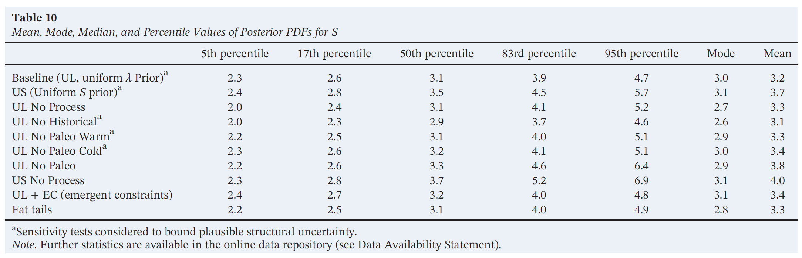

```{r setup, include=FALSE}
knitr::opts_chunk$set(echo = TRUE)
```

# Goal 

Programming sensitivity tests across bulk data information. See the R markdown document working through the baseline prior sensitivity test for a breakdown of what each iteration here is attempting (file = baseline_sensitivity_test.Rmd).

# Load Libraries ans source funcitons

```{r}
# load libraries
library(ggplot2)
library(rjags)
library(coda)

# source functions
source("markdown_docs/log_functions.R")
```

# Analysis 

To conduct this sensitivity analysis, I am using data reported in Table 10 of Sherwood et al. 2020: 

```{r, echo=FALSE}

```

I am using the fixed mean values reported in the table as my mean in the MCMC, while using the data for each line of evidence as "observations" - listing the mode value twice.

```{r}
# list fixed mean values
mean_value <- c(3.2, 3.3, 3.1, 3.8, 3.3)
```

```{r}
# list data for each line of evidence
UL = c(2.3, 2.6, 3.1, 3.9, 4.7, 3.0, 3.0, 3.2)
n_UL = length(UL)
no_process = c(2.0, 2.4, 3.1, 4.1, 5.2, 2.7, 2.7, 3.3)
n_np = length(no_process)
no_historical = c(2.0, 2.3, 2.9, 3.7, 4.6, 2.6, 2.6, 3.1)
n_nh = length(no_historical)
no_paleo = c(2.2, 2.6, 3.3, 4.6, 6.4, 2.9, 2.9, 3.8)
n_npa = length(no_paleo)
fat_tails = c(2.2, 2.5, 3.1, 4.0, 4.9, 2.8, 2.8, 3.3)
n_ft = length(fat_tails)
```

Place data into a list to pass to `JAGS`:
```{r}
dat <- list(
  UL_jags = list(y = UL, n = n_UL),
  no_process_jags = list(y = no_process, n = n_np),
  no_historical_jags = list(y = no_historical, n = n_nh),
  no_paleo_jags = list(y = no_paleo, n = n_npa),
  fat_tails_jags = list(y = fat_tails, n = n_ft)
)
```


Specify the model:
```{r}
mod1_string <- " model {
 
 # likelihood
 for (i in 1:n) {
 y[i] ~ dlnorm(mu, tau)
 }
 
 # prior
 mu = fixed_mu
 tau ~ dunif(0, 10)
 
 # ouput
 sigma = sqrt(1 / tau)
 log_sigma = log(sigma)
 
}"
```

Specify initial values:
```{r}
# specifying initial values
inits <- function() {
  inits = list("tau" = runif(1))
}
```

Specify params:
```{r}
params <- c("mu", "log_sigma")
```


Create a results list to store results:
```{r}
results <- list()
```

Loop the mod1 across each data set with its corresponding fixed mean value:
```{r, results='hide'}
for (i in 1:length(dat)) {
  
  # identify jags data before initializing and running model
  data_jags = dat[[i]]
  
  # mean value
  fixed_mu = mean_value[i]
  
  mod1_string <- gsub("fixed_mu", as.character(fixed_mu), mod1_string)
  
  mod1 <- jags.model(textConnection(mod1_string), 
                     data = data_jags,
                     inits = inits,
                     n.chains = 2)
  
  update(mod1, 1000)
  mod1_sim <- coda.samples(mod1,
                           variable.names = params,
                           n.iter = 15000)
  
  results_name <- names(dat)[i]
  results[[results_name]] <- summary(mod1_sim)
    
  }
```

Generate samples to plot posterior densities:
```{r}
samples <- list()

for (i in 1:length(results)) {
  
  # mu for sample generator
  mu_val = mean_value[i]
  
  # sigma for sample generator
  sigma_val = results[[i]]$statistics[1, 1]
  
  # generate values
  ECS_samples = generate_lognormal_samples(mu = mu_val, 
                                           sigma = sigma_val, 
                                           n_samples = 100000)
  
  # get names for evidence
  evidence = names(results)[i]
  
  # store dfs in list
  samples[[evidence]] <- data.frame(ECS_samples = ECS_samples, Evidence = evidence)
  
}
```

Bind the list together to make a df of samples for each line of evidence for this prior
```{r}
ECS_prior1 <- do.call(rbind, samples)

# reset row names to NULL
row.names(ECS_prior1) <- NULL
```

Plot posterior densities for this prior for each line of evidence:
```{r}
ggplot() +
  geom_density(data = ECS_prior1, aes(x = ECS_samples),
               color = "#0A9F9D", 
               fill = "#0A9F9D",
               alpha = 0.2) +
  theme_light() +
  facet_wrap(~Evidence)
```

